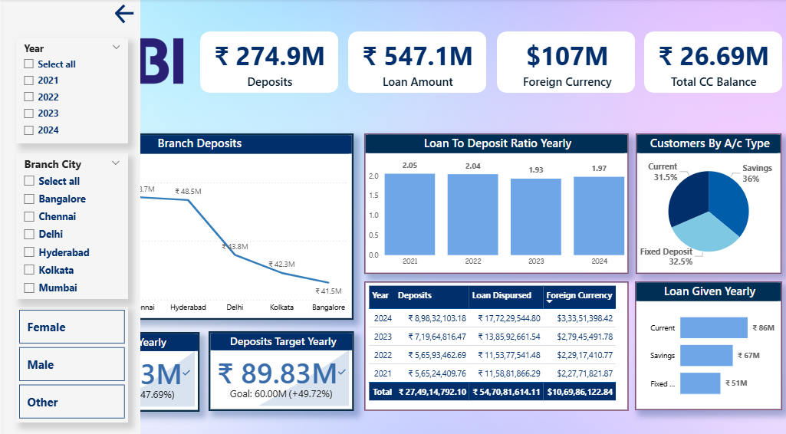

# 🏦 SBI Banking Dashboard - Power BI Project

A professional and insightful banking dashboard built using **Microsoft Power BI**, showcasing critical performance metrics and customer insights for **State Bank of India (SBI)**. This project demonstrates how modern BI tools can be used to monitor financial operations, visualize loan and deposit activities, and track targets across various banking parameters.

---

## 📌 Project Objective

The main goal of this project is to provide a 360-degree analytical view of SBI's banking operations using a visually rich and interactive dashboard. The dashboard focuses on:

- **Customer segmentation**
- **Branch-wise performance**
- **Loan vs. deposit analytics**
- **Foreign currency trends**
- **Goal tracking and year-wise comparison**

---

## 📁 Files Included

| File Name                    | Description                                         |
|-----------------------------|-----------------------------------------------------|
| `SBI Banking Dashboard.pbit`| Power BI template file with predefined visuals and DAX logic |
| `Dashboard Main.png`        | Screenshot of the main dashboard page              |
| `Customers Section.png`     | Screenshot showing customer-focused metrics        |
| `Slicers.png`               | Screenshot showing filter/slicer panel             |

---

## 📊 Dashboard Sections

### 1. 🔹 Main Dashboard

**Key Visuals and Metrics:**
- **Total Deposits, Loan Amount, Foreign Currency, CC Balance**
- **Branch-Wise Deposits Trend** (line chart)
- **Loan to Deposit Ratio (Yearly)** - bar chart
- **Customers by Account Type** - pie chart
- **Loan and Deposit Targets vs Achieved**
- **Year-wise Breakdown Table** (deposits, loans disbursed, foreign currency)

### 2. 🔹 Customer Insight Section

**Highlights:**
- **Total Customers Count**
- **Average Loan, Foreign Currency, and CC Balance**
- **Top 10 Occupations by Deposit Value**
- **Loan Type Distribution** - donut chart
- **Gender & City-Wise Branch Deposit Analysis** - line chart

### 3. 🔹 Slicers Panel

**Filters Available:**
- **Year:** 2021 to 2024
- **Branch City:** Bangalore, Chennai, Delhi, Hyderabad, Kolkata, Mumbai
- **Gender:** Male, Female, Other

These slicers allow users to explore the data dynamically based on demographics, locations, and time periods.

---

## ⚙️ Power BI Features Used

- **Custom DAX Measures**  
- **KPI Cards** for quick metric summaries  
- **Pie, Line, Bar & Donut Charts** for intuitive visualizations  
- **Slicers/Filters** for user-driven exploration  
- **Data Modeling & Relationship Building**  
- **Target vs Actual Comparisons**  

---
Other DAX measures include:

Average Loan Amount

Average Foreign Currency

Total Deposits/Loans by Year

KPI Goal Achievement % (Loan Target vs. Actual, etc.)

🔎 Insights You Can Derive
📈 Which branches are performing better in terms of deposits?

🧑‍💼 Which occupations bring in the highest deposit volumes?

🏠 What is the distribution of loan types offered?

📅 How is the Loan-to-Deposit ratio changing over time?

🎯 Are the target values for loans and deposits being met?

👥 What is the customer composition by account type and gender?

🚀 How to Use This Project

Clone or download this repository.

Open SBI Banking Dashboard.pbit in Power BI Desktop.

If you have your own data source, connect it accordingly.

Use slicers on the left panel to apply filters by year, city, and gender.

Explore each section to uncover performance and insights.

Customize or extend it for your own organization if needed.

📦 Requirements

Power BI Desktop (Latest version recommended)

No external data connection needed (if sample data is embedded)

Optional: Replace with your own banking dataset for real-time analysis

📌 Use Cases

Bank performance reviews

Executive summary for financial board meetings

Internal audit visualization

Loan management analytics

Regional branch comparisons

Thank You
